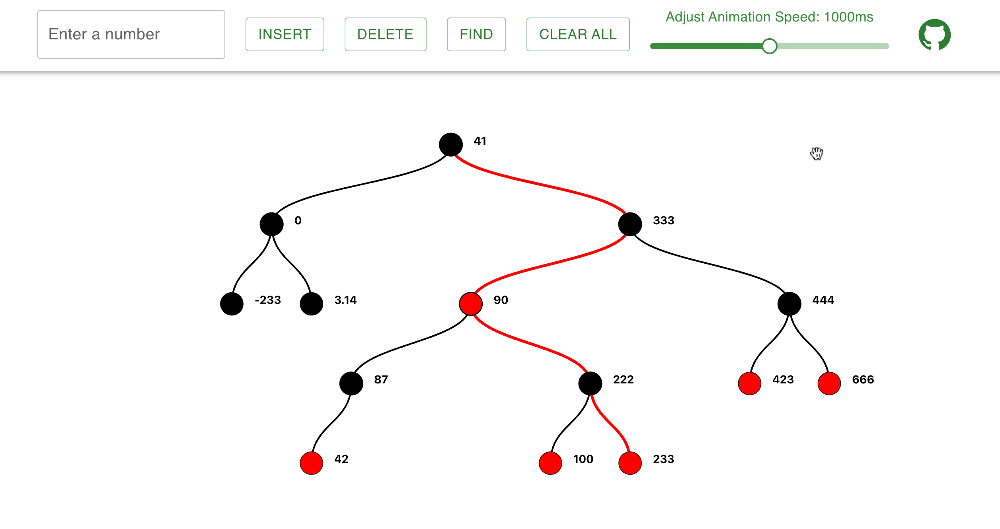

# An Interactive Red Black Tree visualizer

A simple Red Black Tree visualizer, built with [react-d3-tree](https://github.com/bkrem/react-d3-tree) & [Material-UI](https://material-ui.com/).



Try it online: [https://yuanruqian.github.io/red-black-tree-dataviz/](https://yuanruqian.github.io/red-black-tree-dataviz/)

## Features

- Insert
- Delete
- Hightlight the path from root to target node
- Clear the tree
- Adjust the speed of animation ( transition duration )

## Want to run it locally?

```bash
git clone https://github.com/YuanRuQian/red-black-tree-dataviz.git
cd red-black-tree-dataviz
yarn install
yarn start
```

## Want to run the tests?

```bash
yarn test
```

## Want to format the code?

```bash
yarn format
```

